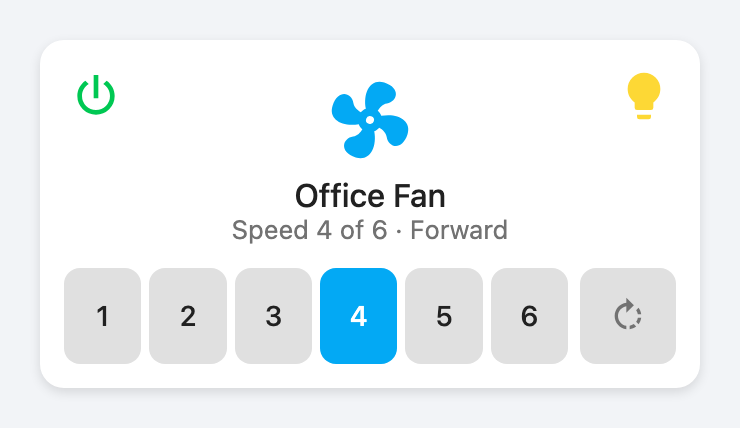
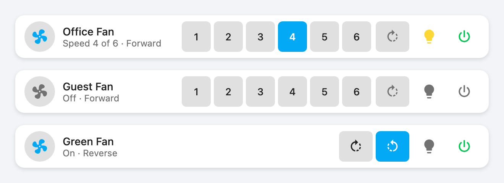
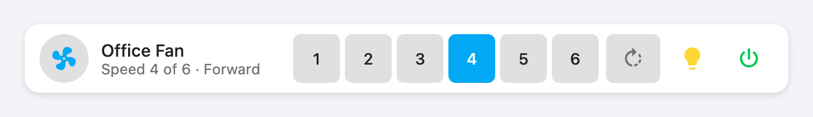
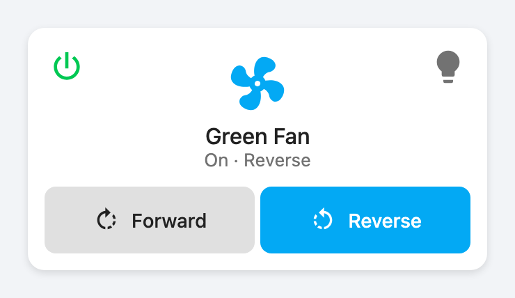
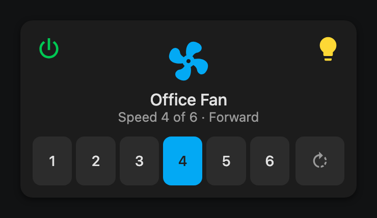
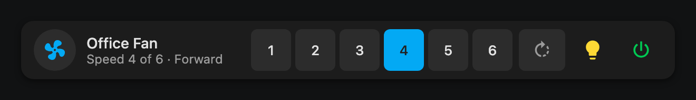

# Fan Remote Card

[![hacs][hacsbadge]][hacs]
[![GitHub Release][releases-shield]][releases]
[![License][license-shield]](LICENSE)

A Lovelace custom card that controls a multi-speed fan the way its **physical
remote** works: N discrete speed buttons (derived from the entity, not
hardcoded), corner buttons for all-off and light, and an optional direction
control.

Stock and mushroom fan cards render a percentage *slider* — a lossy continuous
UI over what is, for most ceiling fans, discrete absolute state. If your remote
has six buttons, your dashboard should too.



Two layouts, same behavior — the full card above, or a compact one-liner for
wide columns:



Entity-generic: works with any Home Assistant `fan` entity that exposes
discrete speeds via `percentage_step` (ESPHome, Bond, Tuya, SmartWings, Zigbee
canopy modules, template fans). No integration-specific coupling.

## Installation

### HACS (custom repository)

1. HACS → three-dot menu → **Custom repositories**.
2. Add `https://github.com/bforejt/lovelace-fan-remote-card` with type
   **Dashboard**.
3. Install **Fan Remote Card** and reload your browser.

### Manual

Download `fan-remote-card.js` from the [latest release][releases], copy it to
`config/www/`, and add a dashboard resource:

```yaml
url: /local/fan-remote-card.js
type: module
```

## Configuration

Minimal:

```yaml
type: custom:fan-remote-card
entity: fan.green_fan
```

Everything:

```yaml
type: custom:fan-remote-card
entity: fan.green_fan                # required, domain: fan
light_entity: light.green_fan_light  # optional: adds the light corner button
name: Green Fan                      # optional, defaults to friendly_name
icon: mdi:ceiling-fan                # optional
show_direction: true                 # optional, default false
speed_count: 6                       # optional override, see below
all_off_action:                      # optional, standard HA action config
  action: perform-action
  perform_action: script.green_room_all_off
```

| Option           | Type    | Default         | Description                                                                                                     |
| ---------------- | ------- | --------------- | --------------------------------------------------------------------------------------------------------------- |
| `entity`         | string  | **required**    | A `fan.` entity                                                                                                  |
| `light_entity`   | string  | —               | A `light.` entity; renders the top-right light toggle                                                            |
| `name`           | string  | `friendly_name` | Card title under the icon                                                                                        |
| `icon`           | string  | `mdi:fan`       | Center icon; gray when off, colored and spinning while the fan is on                                             |
| `layout`         | string  | `card`          | `row` renders a compact single-line variant: icon + name, speed digits, direction, light, all-off in one bar     |
| `show_speeds`    | boolean | `true`          | Set `false` for fans that ignore speed (forward/reverse/off units): hides the speed buttons                      |
| `show_direction` | boolean | `false`         | Direction control; only rendered when the entity supports direction                                              |
| `speed_count`    | integer | derived         | Number of speed buttons (2–10). Overrides the derived value                                                      |
| `default_speed`  | integer | —               | With `show_speeds: false`: the speed sent when turning on. Empty = the device resumes its last speed             |
| `all_off_action` | action  | —               | Replaces the default all-off behavior (`fan.turn_off` + `light.turn_off`) with any standard HA action, e.g. a script |

### How the speed count is derived

The card reads the entity's `percentage_step` attribute and computes
`round(100 / percentage_step)`, clamped to 2–10. A 6-speed ESPHome fan reports
`percentage_step: 16.67` → six buttons. If your integration reports a wrong or
missing `percentage_step` (some Tuya fans), set `speed_count` explicitly.

Tapping speed button *i* calls `fan.set_percentage` with
`round(i × 100 / n)` — Home Assistant rounds to the nearest supported speed.
Fans with more than 6 speeds wrap the buttons onto two rows so they stay
finger-sized on tablets.

### Controls

Every control works like the physical remote: **one press does what it says,
from any state**. Speed buttons turn the fan on at that speed. Direction
pressed while the fan is stopped starts it in that direction. Re-pressing
the current state is harmless (stateful integrations simply ignore the
duplicate). The center icon is the master on/off (turn-on resumes the fan's
remembered speed) and spins while the fan runs, faster at higher speeds.
When the direction control is shown, the status line includes the stored
direction (e.g. `Off · Reverse`) — that's the direction a turn-on will use.

| Control          | Tap                                             | Hold      |
| ---------------- | ----------------------------------------------- | --------- |
| Center icon      | `fan.turn_off` / `fan.turn_on` (resumes remembered speed) | More info |
| Speed button     | `fan.set_percentage` — works from off too       |           |
| ⏻ (top-left)     | All off: fan + light, or `all_off_action`. Green while anything is on |  |
| 💡 (top-right)   | `light.toggle`                                  |           |
| Direction        | `fan.set_direction`; from off also `fan.turn_on` (starts the fan) |   |

### Row layout



`layout: row` compresses the whole card into one line for wide columns —
the icon chip and name act as the master power, the speed digits replace
the percentage slider a stock row would show, and direction, light, and
all-off ride at the end of the bar. All behavior is identical to the full
card; it's purely a layout change. A full-featured 6-speed row needs a wide
column (~600 px+) for a single line; in narrower columns the controls wrap
onto a second line (never overlapping), and fans with more than 6 speeds
stack their digits two-high.

### Fans that ignore speed



Some fans (certain forward/reverse/off canopy modules) accept speed frames
but don't act on them. Set `show_speeds: false` to drop the speed row; with
`show_direction: true` you get a two-button `Forward | Reverse` row instead,
matching that remote's F/R buttons. `default_speed` pins the percentage sent
on turn-on; leave it empty to let the device resume its last speed.

The card renders purely from Home Assistant state — no optimistic local state.
For one-way RF fans (assumed-state entities), HA is the source of truth by
definition.

## Theming

 

Colors come entirely from HA theme variables (`--primary-color`,
`--secondary-background-color`, `--warning-color`, …). Unavailable entities are
flagged with `--warning-color` accents and disabled controls. The power
button's on-state green can be themed via `--fan-remote-power-on-color`
(default `#00c853`).

## Development

```bash
corepack enable
yarn install
yarn start        # dev server on :5000 with watch
yarn build        # lint + bundle to dist/fan-remote-card.js
dev/shoot.sh      # regenerate docs/images/*.png from dev/screenshot.html
```

The included devcontainer starts a Home Assistant instance at
`localhost:8123` (user/pass: `dev`/`dev`) with a simulated 6-speed template
fan (`fan.test_fan`) and light (`light.test_fan_light`) for testing.

### Tip: RF-bridge fans and drifted state

If your fan is behind a stateful one-way RF bridge (like the companion
ESPHome project below), entity services are diff-gated: when HA already
believes everything is off, `fan.turn_off` transmits nothing — so a fan or
light that drifted out of sync stays on. Point `all_off_action` at the
bridge's raw "All Off" button instead; it always transmits the atomic
all-off frame and force-syncs:

```yaml
all_off_action:
  action: perform-action
  perform_action: button.press
  target:
    entity_id: button.green_all_off
```

## Companion projects

This card is the frontend companion to an ESPHome-based 433 MHz RF fan
controller project (B99/EV1527 protocol, ESP32 + CC1101). Link coming when it
is published.

[hacs]: https://github.com/hacs/integration
[hacsbadge]: https://img.shields.io/badge/HACS-Custom-orange.svg
[releases]: https://github.com/bforejt/lovelace-fan-remote-card/releases
[releases-shield]: https://img.shields.io/github/release/bforejt/lovelace-fan-remote-card.svg
[license-shield]: https://img.shields.io/github/license/bforejt/lovelace-fan-remote-card.svg
